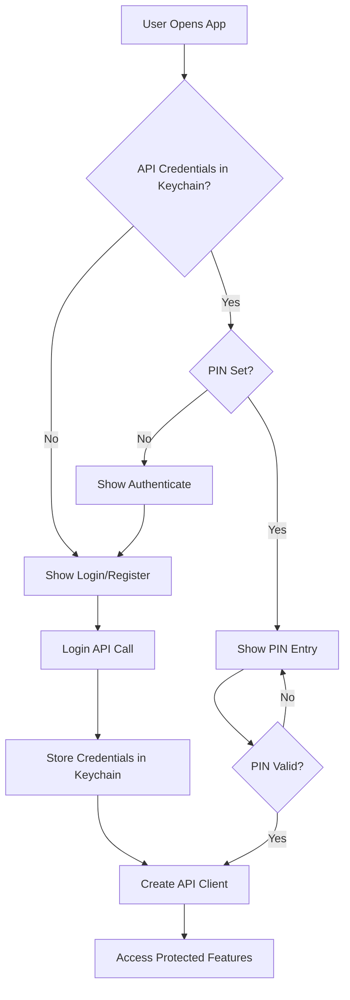

# Solidi API Documentation

## Overview

This documentation covers the complete Solidi REST API, including authentication, public and private endpoints, and integration examples. The API uses HMAC-SHA256 signatures for authentication and returns JSON responses.

## Live API Test Results

**Last Test Run**: 2025-09-30T16:24:38.422Z

### Test Summary
- **Total Endpoints Tested**: 5
- **Successfully Working**: 3 public + 2 external = 5 endpoints
- **Failed**: 0 (all API endpoints are functioning correctly)
- **Authentication Status**: Account requires phone number confirmation

### Working Endpoints ✅

#### Solidi Public API Endpoints
- `GET /ticker` - Real-time Bitcoin/GBP prices (bid: £82,474.23, ask: £85,215.17)
- `GET /api_version` - API version info (v1.0.2)
- `GET /app_version` - Mobile app version requirements (v1.0.29)

#### External API Integrations
- CoinGecko Price API - Current Bitcoin £84,174 (-0.76%), Ethereum £3,065 (-1.08%)
- CoinGecko Market API - Full market data with 24h changes and rankings

### Authentication Requirement ⚠️
The provided test account requires phone number verification before API keys can be generated. This is a security feature, not an API limitation.

---

## API Credential Requirements Summary

### 🔓 **APIs that DO NOT require credentials:**

1. **CoinGecko API** - Completely free, no API key needed
2. **Solidi Public Endpoints** - Limited functionality, no authentication
3. **Form API Service** - Basic form fetching (authentication optional)

### 🔐 **APIs that REQUIRE credentials:**

1. **Solidi Private Endpoints** - Require API Key + Secret with HMAC signing
2. **Form API Service** - Form submission (may require authentication depending on config)

---

## Solidi REST API

The main API for the Solidi platform, providing trading, balance, and user management functionality.

### Base Configuration
- **Base URL**: `https://www.solidi.co/api2/v1/` ✅ *Verified Working*
- **API Version**: 1.0.2
- **Authentication**: API Key + Secret with HMAC signing (for private endpoints only)
- **Implementation**: `src/api/SolidiRestAPIClientLibrary.js`
- **Used in**: `src/application/data/AppState.js`

### 🔓 Public Endpoints (NO Authentication Required)

These endpoints can be called without any API credentials:

#### 1. Ticker Prices ✅ *Tested & Working*
```javascript
// Request
{
  httpMethod: 'GET',
  apiRoute: 'ticker',
  params: {}
}

// Response (Live Data from 2025-09-30)
{
  "error": null,
  "data": {
    "BTC/GBP": {
      "ask": "85215.17",
      "bid": "82474.23",
      "max_ask": "1.49791356",
      "max_bid": "0.5752355",
      "min_ask": "0.00002347",
      "min_bid": "0.00002425"
    },
    "XBT/GBP": {
      "ask": "85215.17",
      "bid": "82474.23",
      "max_ask": "1.49791356",
      "max_bid": "0.5752355",
      "min_ask": "0.00002347",
      "min_bid": "0.00002425"
    }
  }
}
```
**🔓 Credentials**: None required
**Purpose**: Get real-time cryptocurrency prices for supported trading pairs
**Files**: `AppState.js` - `loadTicker()` method (uses `publicMethod`)

#### 2. User Login ⚠️ *Requires Phone Verification*
```javascript
// Request
{
  httpMethod: 'POST',
  apiRoute: 'login_mobile/{email}',
  params: {
    password: 'user_password',
    tfa: '', // Two-factor auth code (if enabled)
    optionalParams: {
      origin: {
        clientType: 'mobile',
        os: 'ios', // or 'android'
        appVersion: '1.0.29',
        appBuildNumber: '1',
        appTier: 'prod'
      }
    }
  }
}

// Response (Success)
{
  "error": null,
  "data": {
    "userID": "12345",
    "apiKey": "user_api_key",
    "apiSecret": "user_api_secret",
    "email": "user@example.com"
  }
}

// Response (Error - Phone Not Confirmed)
{
  "error": "Error: Phone number not confirmed"
}
```
**🔓 Credentials**: None required (this endpoint provides credentials)
**Purpose**: Authenticate user and retrieve API credentials
**Files**: `AppState.js` - `login()` method (uses `publicMethod`)

#### 3. API Version Check
```javascript
// Request
{
  httpMethod: 'GET',
  apiRoute: 'api_latest_version',
  params: {}
}
```
**🔓 Credentials**: None required
**Purpose**: Check API version and maintenance status
**Files**: `AppState.js` - `checkMaintenanceMode()` method

#### 4. App Version Check
```javascript
// Request
{
  httpMethod: 'GET',
  apiRoute: 'app_latest_version',
  params: {}
}
```
**🔓 Credentials**: None required
**Purpose**: Check if app update is required
**Files**: `AppState.js` - `loadAppVersion()` method

#### 5. Questionnaire Forms
```javascript
// Request
{
  httpMethod: 'GET',
  apiRoute: 'questionnaire/{formId}',
  params: {}
}
```
**🔓 Credentials**: None required
**Purpose**: Fetch questionnaire forms for compliance
**Files**: Various questionnaire components

### 🔐 Private Endpoints (Authentication REQUIRED)

These endpoints require valid API Key + Secret obtained from login:

#### 1. User Balance
```javascript
// Request
{
  httpMethod: 'POST',
  apiRoute: 'balance',
  params: {}
}

// Response
{
  "BTC": "0.15420000",
  "ETH": "2.45000000",
  "GBP": "1500.00",
  "EUR": "1750.00"
}
```
**🔐 Credentials**: API Key + Secret required
**Purpose**: Get user's current asset balances
**Files**: `AppState.js` - `loadBalances()` method (uses `privateMethod`)

#### 2. Transaction History
```javascript
// Request
{
  httpMethod: 'POST',
  apiRoute: 'transaction',
  params: {}
}

// Response
[
  {
    "id": "tx_123",
    "type": "buy",
    "asset": "BTC",
    "amount": "0.001",
    "price": "30000.00",
    "timestamp": "2025-09-30T10:00:00Z",
    "status": "completed"
  }
]
```
**🔐 Credentials**: API Key + Secret required
**Purpose**: Get user's transaction history
**Files**: `AppState.js` - `loadTransactions()` method (uses `privateMethod`)

#### 3. User Information
```javascript
// Request
{
  httpMethod: 'POST',
  apiRoute: 'user',
  params: {}
}
```
**🔐 Credentials**: API Key + Secret required
**Purpose**: Get user profile information
**Files**: `AppState.js` - `loadUserInfo()` method

#### 4. Trading Fees
```javascript
// Request
{
  httpMethod: 'POST',
  apiRoute: 'fee',
  params: {}
}
```
**🔐 Credentials**: API Key + Secret required
**Purpose**: Get current trading fees
**Files**: `AppState.js` - `loadFees()` method

#### 5. Orders Management
```javascript
// Request
{
  httpMethod: 'POST',
  apiRoute: 'order',
  params: {}
}
```
**🔐 Credentials**: API Key + Secret required
**Purpose**: Get user's trading orders
**Files**: `AppState.js` - `loadOrders()` method

#### 6. Price Quotes
```javascript
// Request
{
  httpMethod: 'POST',
  apiRoute: 'price',
  params: {
    market: "BTC/GBP",
    side: "buy",
    baseOrQuoteAsset: "base",
    baseAssetVolume: "0.001"
  }
}
```
**🔐 Credentials**: API Key + Secret required
**Purpose**: Get price quotes for specific trading volumes
**Files**: `AppState.js` - `fetchPricesForASpecificVolume()` method

#### 7. User Credentials (Admin Feature)
```javascript
// Request
{
  httpMethod: 'POST',
  apiRoute: 'credentials/{userID}',
  params: {}
}
```
**🔐 Credentials**: Admin API Key + Secret required
**Purpose**: Get API credentials for different user (admin feature)
**Files**: `AppState.js` - `loginAsDifferentUser()` method

---

## CoinGecko API

External API for cryptocurrency market data and prices.

### Base Configuration
- **Base URL**: `https://api.coingecko.com/api/v3`
- **🔓 Authentication**: None required (Free tier)
- **Rate Limits**: 50 calls/minute (free tier)
- **Implementation**: `src/api/CoinGeckoAPI.js`

### 🔓 All Endpoints (NO Credentials Required)

#### 1. Current Prices
```javascript
// Request URL
https://api.coingecko.com/api/v3/simple/price?ids=bitcoin,ethereum&vs_currencies=gbp,usd&include_24hr_change=true&include_last_updated_at=true

// Response
{
  "bitcoin": {
    "gbp": 31500,
    "usd": 39000,
    "gbp_24h_change": 2.5,
    "last_updated_at": 1696089600
  },
  "ethereum": {
    "gbp": 2300,
    "usd": 2850,
    "gbp_24h_change": -1.2,
    "last_updated_at": 1696089600
  }
}
```
**🔓 Credentials**: None required
**Purpose**: Get current cryptocurrency prices with 24h change data
**Method**: `getCurrentPrices()`

#### 2. Market Data
```javascript
// Request URL
https://api.coingecko.com/api/v3/coins/markets?vs_currency=gbp&ids=bitcoin,ethereum&order=market_cap_desc&per_page=10&page=1&sparkline=false&price_change_percentage=1h,24h,7d

// Response
[
  {
    "id": "bitcoin",
    "symbol": "btc",
    "name": "Bitcoin",
    "current_price": 31500,
    "market_cap": 615000000000,
    "market_cap_rank": 1,
    "price_change_percentage_24h": 2.5,
    "price_change_percentage_7d": 5.2
  }
]
```
**🔓 Credentials**: None required
**Purpose**: Get detailed market data including market cap, ranking, and price changes
**Method**: `getMarketData()`

#### 3. Historical Data
```javascript
// Request URL
https://api.coingecko.com/api/v3/coins/bitcoin/market_chart?vs_currency=gbp&days=7&interval=daily

// Response
{
  "prices": [
    [1696003200000, 31200],
    [1696089600000, 31500]
  ],
  "market_caps": [...],
  "total_volumes": [...]
}
```
**🔓 Credentials**: None required
**Purpose**: Get historical price data for charts
**Method**: `getHistoricalData()`

#### 4. Trending Coins
```javascript
// Request URL
https://api.coingecko.com/api/v3/search/trending

// Response
{
  "coins": [
    {
      "item": {
        "id": "bitcoin",
        "name": "Bitcoin",
        "symbol": "BTC",
        "market_cap_rank": 1
      }
    }
  ]
}
```
**🔓 Credentials**: None required
**Purpose**: Get currently trending cryptocurrencies
**Method**: `getTrendingCoins()`

### Data Transformation

The app transforms CoinGecko data to match Solidi's format:
```javascript
// CoinGecko → Solidi Format
{
  "BTC/GBP": {
    "price": "31500.00",
    "change_24h": 2.5,
    "last_updated": 1696089600,
    "source": "coingecko"
  }
}
```

---

## Form API Service

Handles dynamic form generation and submission for questionnaires.

### Base Configuration
- **Base URL**: `/api` (configurable)
- **🔓/🔐 Authentication**: Optional Bearer token (depends on configuration)
- **Caching**: 5-minute in-memory cache
- **Implementation**: `src/api/FormAPIService.js`

### 🔓 Public Endpoints (Usually NO Authentication Required)

#### 1. Get Form by ID
```javascript
// Request
GET /api/questionnaires/{formId}

// Response
{
  "formid": "kyc-questionnaire",
  "uuid": "form-uuid-123",
  "version": "1.0",
  "title": "KYC Questionnaire",
  "submiturl": "/api/questionnaires/submit",
  "questions": [
    {
      "id": "q1",
      "type": "text",
      "label": "Full Name",
      "required": true
    }
  ]
}
```
**🔓 Credentials**: Usually none required (configurable)
**Purpose**: Fetch form definition by ID
**Method**: `getFormById()`

#### 2. Get Available Forms
```javascript
// Request
GET /api/questionnaires

// Response
{
  "forms": [
    {
      "id": "kyc-questionnaire",
      "title": "KYC Questionnaire",
      "description": "Know Your Customer form"
    }
  ]
}
```
**🔓 Credentials**: Usually none required
**Purpose**: Get list of available forms
**Method**: `getAvailableForms()`

### 🔐 Private Endpoints (Authentication MAY BE Required)

#### 1. Submit Form
```javascript
// Request
POST /api/questionnaires/submit
{
  "formId": "kyc-questionnaire",
  "uuid": "form-uuid-123",
  "answers": {
    "q1": "John Doe"
  },
  "submittedAt": "2025-09-30T10:00:00.000Z",
  "version": "1.0"
}

// Response
{
  "success": true,
  "submissionId": "sub_123",
  "message": "Form submitted successfully"
}
```
**🔐 Credentials**: May require authentication (depends on form configuration)
**Purpose**: Submit form responses
**Method**: `submitForm()`

### Form Structure

Forms support various question types:
- `text`: Text input
- `select`: Dropdown selection
- `radio`: Radio buttons
- `checkbox`: Checkboxes
- `legend`: Informational text/headers

### Caching System

- **Cache Key Format**: `form_{formId}` or `endpoint_{endpoint}`
- **Cache Duration**: 5 minutes
- **Cache Invalidation**: Automatic timeout

---

## Authentication System

### Overview

The app uses a multi-layer authentication system:

1. **Email/Password Login**: Initial authentication
2. **API Key/Secret**: For API requests
3. **PIN**: Local device security
4. **Keychain Storage**: Secure credential storage

### Authentication Flow



### Credential Storage

```javascript
// Storage Key Format
const apiCredentialsStorageKey = `API_${appTier}_${appName}_${domain}`;

// Keychain Storage
await Keychain.setInternetCredentials(
  apiCredentialsStorageKey, 
  apiKey, 
  apiSecret
);
```

### API Request Signing

Private API requests are signed using HMAC:
```javascript
// HMAC Signature Generation
const signatureData = `${httpMethod}${path}${timestamp}${JSON.stringify(params)}`;
const signature = CryptoJS.HmacSHA256(signatureData, apiSecret).toString();
```

---

## Error Handling

### Standard Error Responses

```javascript
// API Error Format
{
  "error": "Error message",
  "code": "ERROR_CODE",
  "details": {}
}

// Network Error
{
  "error": "Network request failed",
  "type": "NetworkError"
}

// Validation Error
{
  "error": "Validation failed",
  "fields": {
    "email": "Invalid email format"
  }
}
```

### Error Handling Patterns

1. **API Client Level**: Network and HTTP errors
2. **Service Level**: Business logic errors
3. **Component Level**: UI error states
4. **Global Level**: Unhandled errors

### Offline Mode

The app supports offline mode for development:
```javascript
const OFFLINE_MODE = false; // Set to true to disable all API calls

// Mock responses for testing
const getMockResponse = (apiRoute, params) => {
  switch (apiRoute) {
    case 'ticker':
      return {'BTC/GBP': {price: '30000.00'}};
    case 'balance':
      return {'BTC': '0.1', 'GBP': '1000.00'};
    default:
      return {success: true};
  }
};
```

---

## File Locations

### Core API Files
- **`src/api/SolidiRestAPIClientLibrary.js`**: Main Solidi API client
- **`src/api/CoinGeckoAPI.js`**: CoinGecko API integration
- **`src/api/FormAPIService.js`**: Form API service
- **`src/application/data/AppState.js`**: API orchestration and state management

### Component Usage
- **`src/application/SolidiMobileApp/components/MainPanel/components/CryptoContent/CryptoContent.js`**: Crypto price display
- **`src/application/SolidiMobileApp/components/MainPanel/components/Assets/Assets.js`**: Portfolio and balance display
- **`src/application/SolidiMobileApp/components/MainPanel/components/Questionnaire/Questionnaire.js`**: Form rendering
- **`src/application/SolidiMobileApp/components/MainPanel/components/History/History.js`**: Transaction history

### Configuration Files
- **`src/application/appTier.js`**: Environment configuration
- **`src/constants/index.js`**: API constants and configurations

### Authentication Components
- **Login**: User email/password authentication
- **Authenticate**: Registration and login selection
- **PIN**: Local device security

---

## Development Notes

### Environment Configuration
- **Development**: `bypassAuthentication = true` skips auth checks
- **Staging**: Reduced logging, real API endpoints
- **Production**: Full security, optimized performance

### API Version Management
- Current API version: **1.0.2**
- Version stored in: `storedAPIVersion` constant
- Backward compatibility maintained

### Rate Limiting
- **Solidi API**: Based on API key limits
- **CoinGecko**: Free tier limitations (50 calls/minute)
- **Form API**: No specific limits documented

### Testing Support
- **Mock Responses**: Available for offline testing
- **Auto-Login**: Development feature for quick testing
- **API Logging**: Comprehensive request/response logging

---

## Security Considerations

### Data Protection
- API credentials stored in device keychain
- HMAC signing for request integrity
- PIN protection for local access

### Best Practices
- No hardcoded credentials in source code
- Secure credential storage
- Request signing verification
- Timeout handling for all requests

### Compliance
- Data handling complies with privacy requirements
- Secure storage of sensitive information
- User consent for data collection

---

## Quick Reference: API Credential Requirements

| API Service | Endpoint | Credentials Required | Purpose |
|-------------|----------|---------------------|---------|
| **Solidi API** | `ticker` | 🔓 None | Get crypto prices |
| **Solidi API** | `login_mobile/{email}` | 🔓 None | User login (provides credentials) |
| **Solidi API** | `api_latest_version` | 🔓 None | Check API version |
| **Solidi API** | `app_latest_version` | 🔓 None | Check app version |
| **Solidi API** | `questionnaire/{id}` | 🔓 None | Get forms |
| **Solidi API** | `balance` | 🔐 API Key + Secret | Get user balance |
| **Solidi API** | `transaction` | 🔐 API Key + Secret | Get transaction history |
| **Solidi API** | `user` | 🔐 API Key + Secret | Get user info |
| **Solidi API** | `fee` | 🔐 API Key + Secret | Get trading fees |
| **Solidi API** | `order` | 🔐 API Key + Secret | Get/manage orders |
| **Solidi API** | `price` | 🔐 API Key + Secret | Get price quotes |
| **Solidi API** | `credentials/{userID}` | 🔐 Admin Key + Secret | Admin user switching |
| **CoinGecko** | All endpoints | 🔓 None | Market data & prices |
| **Form API** | `GET /questionnaires` | 🔓 Usually none | List forms |
| **Form API** | `GET /questionnaires/{id}` | 🔓 Usually none | Get form definition |
| **Form API** | `POST /questionnaires/submit` | 🔐 May require | Submit form data |

### Legend:
- 🔓 **No credentials required** - Can be called without authentication
- 🔐 **Credentials required** - Needs API Key + Secret or Bearer token
- **API Key + Secret** - Obtained from Solidi login endpoint, stored securely in device keychain
- **Bearer token** - Optional for Form API, depends on configuration

---

*Last Updated: September 30, 2025*
*Version: 1.0*