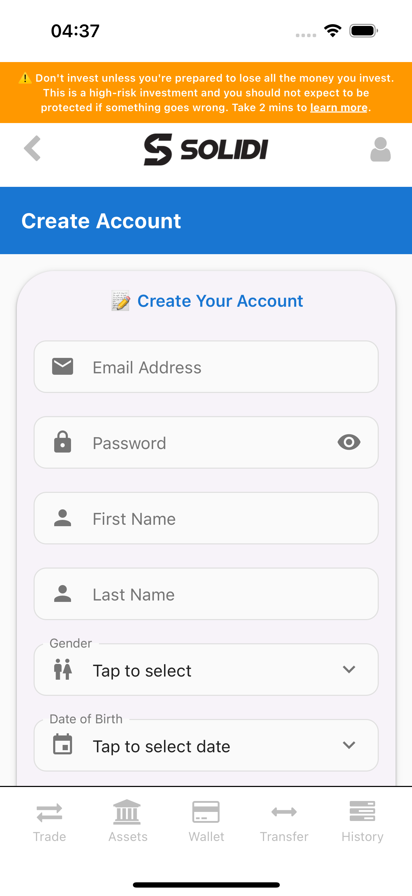
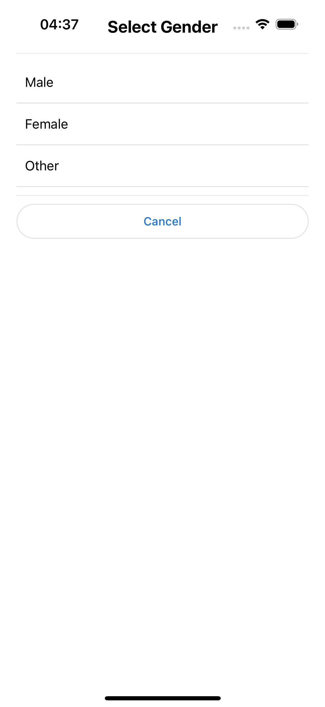

# Issue 84: Fix Dropdown Arrow Interaction Report

## Problem
Users reported that tapping the drop-down arrow (chevron) on input fields like "Gender" did not open the selection interface. This was because the `TextInput.Icon` component was consuming touch events without having an `onPress` handler.

## Solution
I have applied the following fixes:
1.  **Added `onPress` handlers**: Added `onPress` props to the `TextInput.Icon` components in `Register.js` for:
    - Gender
    - Date of Birth
    - Citizenship
    - Country Code
    This ensures that tapping the icon directly triggers the same action as tapping the input field.

2.  **Added `testID`s**: Added `testID` props to key components to improve testability:
    - `register-button` in `Login.js`
    - `gender-input` in `Register.js`
    - `gender-option-{value}` in `Register.js`

## Verification
### Automated Testing
I created and successfully ran an E2E test `issue_84_test.yaml`.
- **Status**: ✅ PASSED
- **Flow**:
    1. Launch app (clean state).
    2. Navigate to Registration screen.
    3. Scroll to Gender field.
    4. Tap specifically on the chevron icon (right side of input).
    5. Verify "Select Gender" modal appears.
    6. Select "Male".

### Manual Verification
You can also perform the following steps to verify the fix manually:
1.  Launch the app.
2.  Navigate to the **Registration** screen (tap "Create New Account").
3.  Locate the **Gender** field.
4.  **Tap specifically on the chevron (arrow) icon** on the right side of the field.
5.  **Verify**: The "Select Gender" modal should appear.

## Screenshots
### Registration Page


### Gender Modal Opened


## Code Changes
### `Register.js`
```javascript
// Before
right={<TextInput.Icon icon="chevron-down" />}

// After
right={<TextInput.Icon icon="chevron-down" onPress={showGenderPicker} />}
```
